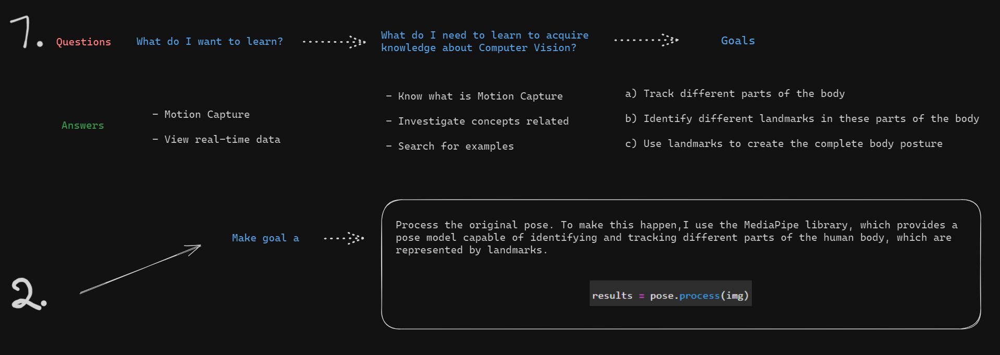

# Body Pose Detection

### Result Videos:
I have 2 videos with different landmark styles, because these videos will be placed within my portfolio https://github.com/BRp99/BRp99.github.io.

[

[

## Intro:

This project is a human body pose detection and extraction tool. I chose a short video showing a person playing basketball.

With this project, I can visualize the player's poses in the video and extract these poses for further analysis.

## Tech Stack:

- Python
- OpenCV
- MediaPipe
- NumPy
- Patience 😅😅😅😅

## Features:

- Track different parts of the body;
  
- Identify different reference points in these parts of the body;
  
- Use landmarks to create the complete body posture.

## Process:

1. Initially, I set up video capture using OpenCV and then used MediaPipe's pose detection functionality to obtain the positions of the landmarks.
   
2. Then I use MediaPipe library for pose detection.

3. The poses were visualized both in the original video and in a separate image, highlighting the extracted pose.

**At the end of this README, you will find videos presenting the project results and images documenting the thought process, providing a deeper understanding of the development journey.**

## Difficulties:

- Manipulation of landmark coordinates to highlight the pose;
  
- Handle different video resolutions;
  
- Stylization of landmarks and connection lines to improve visualization - I experimented with different styles and techniques to highlight these elements in a clear and informative way.

## Learnings:

- I learned how to use the MediaPipe library for pose detection;
  
- I learned how to manipulate video frames and extract poses;
  
- I developed skills in stylizing landmarks and connection lines for a more informative visualization;
  
- I learned how to integrate MediaPipe's functionalities into computer vision projects.

## ✨✨ Improvements:

Style:

- Improve the stylization of landmarks for a more aesthetic visualization;

- Explore advanced visual highlighting techniques in connection lines;

Code:

- Add specific analysis features to the extracted poses;

Compression/Optimization:

- Improve code efficiency to handle different video resolutions;

Algorithm:

- Test whether the algorithm I used is capable of detecting the pose of more than one person in the video;

- Try another algorithm that can capture body segments with fast movements.

## Video and Images

### **Simple Explanation** about the progress of this project:

### **Detailed Explanation** about the progress of this project: 

